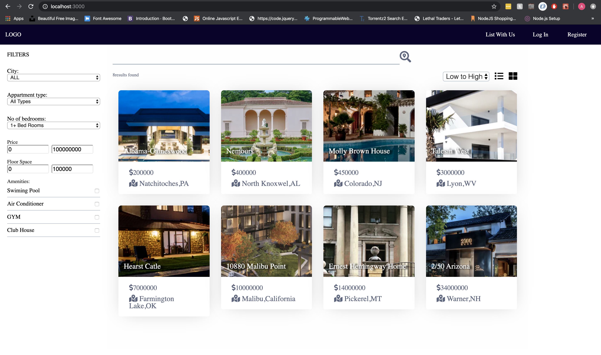
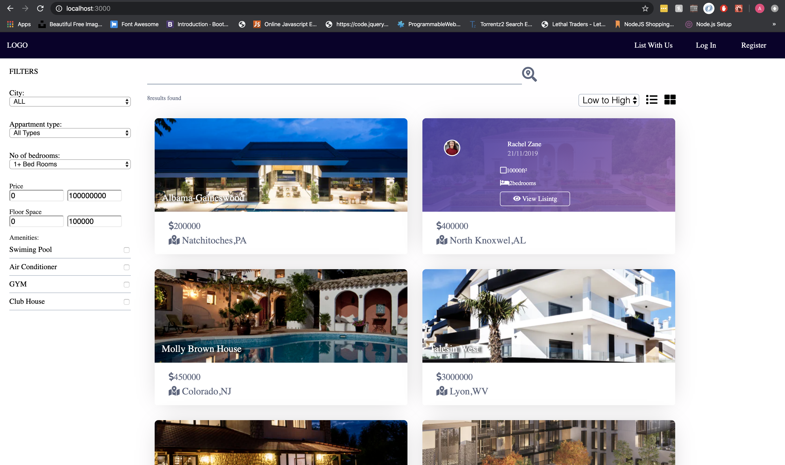

# React-Real-Estate

 *Real-Estate website built on React.*
 
_following are the techonlogies used_
 
 * React.
 * gulp.
 * node.
 * web-pack.
 
 
  
 
 _Steps to use this project_
 
 * Download the repository
 * Type npm install
 * then type:- npm run watch
